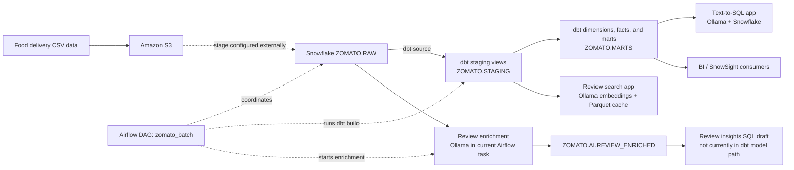
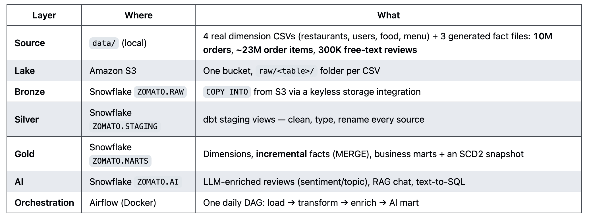
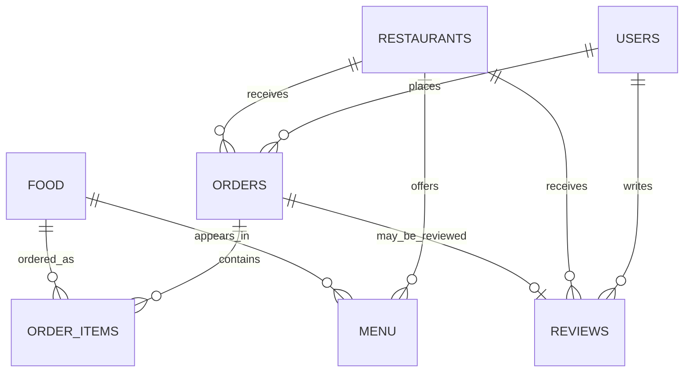
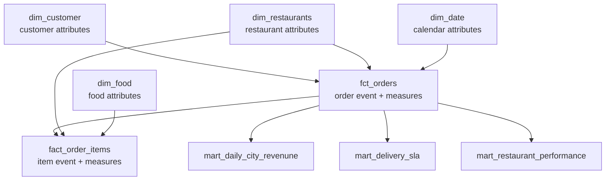
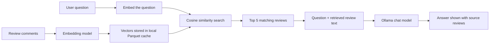

# Architecture and AI Concepts

This guide explains the design represented by the project and relates it to the code that currently exists. It uses the attached architecture and concept diagrams as inspiration, while calling out differences where the diagrams show a broader target design than this repository implements.

## End-to-end data flow

The pipeline has a batch analytics lane and an AI lane. Snowflake is the central warehouse after ingestion. Airflow coordinates the implemented batch steps.



The first S3-to-Snowflake step is represented in the DAG as Snowflake `COPY INTO` commands from `@ZOMATO.RAW.ZOMATO_RAW_STAGE`. The bucket, upload process, storage integration, external stage, file formats, and raw table creation are prerequisites managed outside this repository. The local CSV files under `dbs/` are ignored by Git; there is no upload utility in the current code.

## Layer-by-layer map

The supplied architecture overview describes the project in source, lake, bronze, silver, gold, AI, and orchestration layers. Here is how those layers map to this repository:



This is the supplied reference diagram. Some labels describe the intended architecture rather than deployed functionality; the table below identifies those differences.

| Layer | Location / service | Role and current implementation |
| --- | --- | --- |
| **Source** | Local CSV inputs (`dbs/` in this checkout) | Food-delivery source data for restaurants, users, food, menu, orders, order items, and reviews. The architecture reference describes four dimension CSVs plus three generated fact files, at a scale of 10 million orders, about 23 million order items, and 300,000 reviews. Treat those counts as reference figures: the complete input set is not present in this checkout to verify them. |
| **Lake** | Amazon S3 | Raw files are expected under one folder per table. Uploading the files to S3 is an external/preparation step; no upload script is included here. |
| **Bronze** | Snowflake `ZOMATO.RAW` | Raw source tables are populated using `COPY INTO` from the preconfigured `@ZOMATO.RAW.ZOMATO_RAW_STAGE`. Stage, storage integration, and table setup are prerequisites outside this repository. |
| **Silver** | Snowflake `ZOMATO.STAGING` | dbt staging views standardize names and selected types, filter some invalid values, and join reviews to restaurant city. Cleaning is model-specific; the code does not yet clean every field in every source. |
| **Gold** | Snowflake `ZOMATO.MARTS` | dbt dimensions, incremental order and order-item facts, and business marts support analysis. Snapshot materialization is configured in `fdp/dbt_project.yml`, but there is no snapshot definition in `fdp/snapshots/`; an SCD2 snapshot is therefore not currently built. |
| **AI** | Snowflake `ZOMATO.AI` and local Streamlit apps | Review sentiment/topic enrichment writes to `REVIEW_ENRICHED`. The RAG app searches reviews using Ollama embeddings and a local Parquet cache; the text-to-SQL app generates queries for Snowflake marts. |
| **Orchestration** | Apache Airflow in Docker | The daily DAG runs raw `COPY INTO`, a core dbt build, then Ollama review enrichment. There is no separate final “AI mart” task in the current DAG. |

The source volume figures and “one folder per table” layout above come from the supplied architecture reference, not from a count performed on the current local files. The checked-in configuration and model inventory describe the implemented tables and transformations; use those as the source of truth for what the running code currently builds.

### What Airflow runs today

The `zomato_batch` DAG runs daily without catchup. Its task dependencies are:


There is no `upload_raw` task or second `dbt_build_all` task in the current DAG. The screenshot's orchestration sequence can be read as a proposed expansion, not a description of the checked-in DAG. The existing review insight query is in the repository root, outside `fdp/models/`, so `dbt build` does not build it.

## Source data relationships

The source tables describe customers, restaurants, food/menu offerings, orders, order items, and customer reviews. The diagram below shows the natural relationships in the supplied data model; not every relationship is enforced as a Snowflake constraint.



The raw data includes personal fields such as user email and password in the source diagram. `stg_users` selects an email but does not select a password. Restrict raw data and downstream access according to your data policies; do not expose credentials or unnecessary personal data through analytics apps.

The dbt models normalize selected IDs and data types, but they do not model every source column. For example, `stg_menu` standardizes menu restaurant IDs and prices, while `stg_restaurants` currently renames restaurant fields without cleaning the rating and cost strings.

## Dimensional modeling: facts and dimensions

Dimensional models make business questions easier to answer by separating measurable events from descriptive context:

- **Facts** represent events and measures. `fct_orders` is one row per order with status, timestamps, revenue-related amounts, delivery time, rating, and customer/restaurant identifiers. `fact_order_items` is one row per item within an order with quantity, price, and line amount.
- **Dimensions** describe who, what, or when. The project currently defines `dim_customer`, `dim_restaurants`, `dim_food`, and `dim_date`.
- **Marts** pre-aggregate common questions, such as daily city sales, delivery-time percentiles, and restaurant performance.



This is a star-schema approach: facts sit at the center and connect to dimensions. Clear grains and predictable joins help BI tools and analysts aggregate consistently. The current project has a partial dimensional model rather than all the tables shown in the reference diagram: it uses `dim_customer` rather than `dim_users`, has no `dim_menu_items` model, and the order-item fact is a separate model. The marts also include denormalized reporting fields, such as city and restaurant name.

The two fact models are incremental dbt models using merge keys (`order_id` and `order_item_id`). They select rows later than the latest timestamp already present. This is a simple incremental strategy and does not automatically capture corrections to older records whose timestamps do not advance.

## How the LLM features work

### Next-token prediction, in brief

A language model processes input tokens and estimates probabilities for the next token. It selects or samples a token, appends it to the text, then repeats. Training a model on large text collections makes this prediction process useful for tasks such as classification, summarization, SQL generation, and question answering. A model can still produce unsupported or incorrect output, so applications need validation and grounding in source data.

Prompts commonly separate instructions from input:

- **System message:** task rules and expected response format.
- **User message:** the review, question, or other task input.
- **Assistant message:** the generated response.

Temperature controls variation in generated output. The project's enrichment prompts use temperature `0` to favor repeatable labels; the chat interfaces use a higher temperature for more natural answers. Model choice trades off output quality, latency, availability, and cost. This repository currently uses Ollama models configured by `OLLAMA_MODEL` and `OLLAMA_EMBEDDING_MODEL`; the OpenAI-based enrichment script is an alternate implementation and is not called by the DAG.

### Review enrichment

`ai/enrich_reviews.py` reads unprocessed raw reviews, asks the configured Ollama chat model for JSON classification, and stores the result in `ZOMATO.AI.REVIEW_ENRICHED`. The requested fields are sentiment label, sentiment score, topic, and a short key issue. The Airflow task runs this after the core dbt build.

`fdp/scripts/enrich_reviews.py` is a second, OpenAI-based implementation using `gpt-4o-mini`. The two scripts are alternatives, not two consecutive stages of the deployed DAG.

### Retrieval-augmented generation (RAG)

RAG combines search over project data with a language model:



In this project, `ai/rag_chat.py` samples up to 500 reviews from `ZOMATO.STAGING.STG_REVIEWS`, embeds them with Ollama, and caches the rows and vectors in `ai/review_embeddings.parquet`. For each question it finds the five most similar reviews, passes those as context to the chat model, and displays the selected reviews so a user can inspect the evidence. This grounds the answer in retrieved data and limits irrelevant context, but it does not guarantee correctness. The cache is local and static after creation; remove it to fetch and embed another sample.

The reference image depicts a persistent `vector_store` and cited source numbering. The current implementation uses a Parquet file and displays source review rows; it does not include a dedicated vector database or numbered citations.

### Natural language to SQL

`ai/text_to_sql.py` sends a question and a hard-coded schema description to Ollama, receives SQL, applies a basic statement check, runs the SQL against Snowflake, and displays the results. Its intended flow is:

```text
Question in plain English -> generated SELECT -> basic check -> Snowflake query -> table / optional chart
```

The check is a guardrail, not a complete SQL security boundary. The schema text in the script also needs to be kept aligned with the actual dbt models. Use a Snowflake role limited to read-only access to approved marts when exposing this feature.

## Reference diagrams versus checked-in implementation

The supplied images are useful conceptual references, but several items are aspirational or describe a different implementation:

| Reference concept | Current repository |
| --- | --- |
| Seven source folders loaded from S3 | The DAG copies seven folders from an already-configured Snowflake stage. The code does not upload local CSV files to S3. The dbt source list contains seven tables; the screenshots' `country` table is not declared. |
| OpenAI GPT-4o mini review enrichment | The Airflow DAG runs the Ollama implementation. An OpenAI version exists separately under `fdp/scripts/`. |
| `upload_raw`, then core dbt, enrichment, then `dbt_build_all` | The DAG runs `reload_raw`, `dbt_build_core` excluding `tag:ai`, then `enrich_reviews`. |
| `mart_review_insights` built after enrichment | The SQL draft currently sits at the repository root, outside the dbt model path. |
| Persistent vector store and cited answers | The RAG app stores vectors in a local Parquet cache and shows the retrieved review rows. |
| `dim_users` and `dim_menu_items` around `fct_orders` | Current dimensions include `dim_customer`, `dim_restaurants`, `dim_food`, and `dim_date`; item-level measures are in `fact_order_items`. |
| SnowSight / BI serving | The marts can serve BI tools, but no SnowSight or BI dashboard configuration is included in this repository. |
